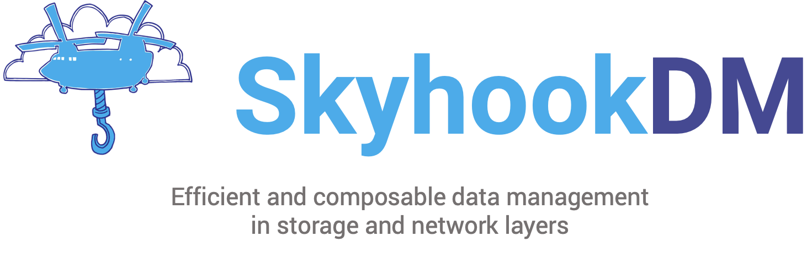

<!--
**skyhookdm/.github** is a ✨ _special_ ✨ repository because its `profile/README.md` (this file) appears on the organization's GitHub profile.
-->

# 🚀 Mission

SkyhookDM is an open source project to enable automatic mapping of data processing of structured data to heterogeneous architectures by providing a framework for efficient and composable data processing in storage and networking layers. SkyhookDM leverages Apache Arrow and other open source projects that receive significant investment by the data management community in science and industry. The project strives to maximize contributions to existing open source projects while minimizing the size (and need for maintenance) of an independent codebase.

# 🤔 Why Storage and networking layers?

A key challenge in data science is extracting efficient and timely insights from an ever increasing flood of data streams. Apache Arrow, an open source data processing framework, provides an efficient and timely approach by reducing in-memory serialization and copy overheads. It is widely used in the development of data management services of structured data due to its interoperability across multiple programming languages and runtimes and plays an essential role in the rapid evolution of the open source data science ecosystem. 

While many existing data management services that use Apache Arrow are well-suited for resource-rich environments, the open source data science ecosystem lacks a common framework for data management services designed for resource-constrained environments, like those found in the storage and networking layers. This has led to a variety of insular and hard-to-reuse embedded data processing solutions. An efficient approach is to reduce data movement within the storage and networking layers by embedding data reductive processing and caching throughout the data path. Like most emerging technologies, computational storage devices, smart NICs, and similar devices where data processing can be embedded have to overcome market entry barriers. Thus reducing complexity, increasing interoperability, and lower development costs are critical issues in embedded data management.

SkyhookDM is a full-stack data management framework with the purpose of bridging the gap between resource-rich and resource-constrained environments to better serve data-intensive applications. By leveraging Apache Arrow in the storage and networking layers, SkyhookDM adds extra data processing capabilities to embedded devices that were previously inflexible black boxes. This allows SkyhookDM to lower market entry barriers by saving costs and accelerating the development of data management services of structured data.

Beyond the integration and portability of data management services to embedded devices, SkyhookDM allows data management systems to interoperate with heterogeneous data management services, data sources, and devices in the storage and networking layers. Sharing rich metadata from data management systems to embedded devices allows data management services to become smarter and better adapt to heterogeneous architectures. This allows truly distributed data management services to interact even more intelligently with their specific hardware and software contexts.

# 💎 Key Features

Built with Apache Arrow, leveraging its ecosystem
- Leverages existing placement mechanisms using object abstraction
- Works with the Ceph distributed storage system
- Skyhook Ceph plugin became part of Apache Arrow 7.0.0
- Ongoing work to support stream processing on smart NICs such as BlueField-2
- Ongoing work to orchestrate distributed processing using Substrait
- Ongoing work to support the Mochi software-defined storage system 
- Ongoing work to support dynamic fallback mechanism to prevent overload

# 🎤 Presentations and 📝 Publications

Some recent presentations and publications can be found on the [project page hosted by iris-hep][proj-skyhookdm].

# 🧑‍🤝‍🧑 People
The Skyhook community is mostly organized around collaborations with some people being funded by multiple sources:

- IRIS-HEP: Jayjeet Chakraborty, Oksana Shadura, Alex Held, Brian Bockelman, Carlos Maltzahn
- Seagate: Aldrin Montana, Philip Kufeldt, Peter Alvaro
- Sandia National Labs: Jianshen Liu, Matthew L. Curry, Craig Ulmer, Carlos Maltzahn
- Argonne National Lab: Jayjeet Chakraborty, Matthieu Dorier, Phil Carns, Rob Ross, Carlos Maltzahn

# 💰 Funding
SkyhookDM is an open source project funded by the Institute for Research and Innovation in Software for High-Energy Physics (IRIS-HEP, NSF OAC-1836650), Sandia National Laboratories, NSF CNS-1764102, Seagate Technologies, and the [Center for Research on Open Source Software][web-cross] at the [University of California Santa Cruz][web-ucsc].

<!-- Resources -->
[web-cross]:       https://cross.ucsc.edu/
[web-ucsc]:        https://www.ucsc.edu/

[proj-skyhookdm]:  https://iris-hep.org/projects/skyhookdm.html

[people-maltzahn]: https://users.soe.ucsc.edu/~carlosm/dev/
[people-lefevre]:  https://users.soe.ucsc.edu/~jlefevre/

[community-arrow]: https://arrow.apache.org/community/
